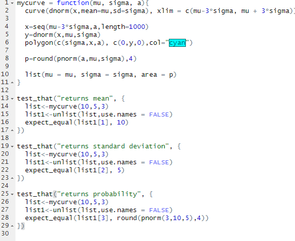

# Task 1
```{r}
  getwd()
```

# Task 2

## Plot 4 normal curves with certain parameters
```{r}
  layout(matrix(1:4, nr=2,nc=2))

  curve(dnorm(x, mean=10,sd=4),xlim=c(-10,30))

  curve(dnorm(x, mean=10,sd=2),xlim=c(-10,30))

  curve(dnorm(x, mean=5,sd=10),xlim=c(-30,40))

  curve(dnorm(x, mean=5,sd=1/2),xlim=c(-10,20))
```

## Plot the following regions and probabilities
```{r}
  layout(matrix(1:4, nr=2,nc=2))

  g1 <- curve(dnorm(x,0,1), xlim=c(0-3*1, 0+3*1))
  x1 <- seq(2, 0+3*1, length=1000)
  y1 <- dnorm(x1, 0, 1)
  polygon(c(2, x1, 0+3*1), c(0, y1, 0), col="cyan")
  prob1 <- round(pnorm(0+3*1, 0, 1) - pnorm(2, 0, 1), 4)
  text(x=2,y=dnorm(2,0,1), paste0("Area=",prob1))

  g2 <- curve(dnorm(x,4,2), xlim=c(4-3*2, 4+3*2))
  x2 <- seq(1, 5, length=1000)
  y2 <- dnorm(x2, 4, 2)
  polygon(c(1, x2, 5), c(0, y2, 0), col="green")
  prob2 <- round(pnorm(5, 4, 2) - pnorm(1, 4, 2), 4)
  text(x=3,y=0.5*dnorm(3,4,2), paste0("Area=",prob2))
  
  g3 <- curve(dnorm(x,10,4), xlim=c(10-3*4, 10+3*4))
  x3 <- seq(10-3*4, 10, length=1000)
  y3 <- dnorm(x3,10,4)
  polygon(c(10-3*4,x3,10), c(0,y3,0), col="orange")
  prob3 <- round(pnorm(10, 10, 4), 4)
  text(x=5,y=0.5*dnorm(5,10,4), paste0("Area=",prob3))
  
  g4 <- curve(dnorm(x,-2, 1/2), xlim=c(-2-3*1/2,-2+3*1/2))
  x4 <- seq(-3,-2,length=1000)
  y4 <- dnorm(x4, -2, 1/2)
  polygon(c(-3,x4,-2), c(0,y4,0), col="yellow")
  prob4 <- round(pnorm(-2, -2, 1/2) - pnorm(-3, -2, 1/2), 4)
  text(x=-2.5,y=0.5*dnorm(-2.5,-2,1/2), paste0("Area=",prob4))
```

# Task 3

## Plot surfaces with shape=1,3,5
```{r}
  library(ggplot2)
  x <- seq(0,20,length=1000)
  
  shape1 <- dgamma(x, shape = 1, scale = 1)
  shape3 <- dgamma(x, shape = 3, scale = 1)
  shape5 <- dgamma(x, shape = 5, scale = 1)

  df <- data.frame(x = rep(x, 3), y = c(shape1, shape3, shape5), 
    Shape = factor(rep(c("Shape=1", "Shape=3", "Shape=5"), each = length(x))))

  ggplot(df, aes(x = x, y = y, color = Shape)) +
  geom_line(linewidth = 1) + 
  labs(title = "Overlay of Gamma Distributions", x = "Y", y = "Density") +
  scale_color_manual(values = c("red", "blue", "green"))
```

## Plot regions and probabilities of gamma

### Y ~ Gamma(shape=3,scale=2), P(2<Y<5)
```{r}
  curve(dgamma(x,shape=3,scale=2),
    xlim=c(0,10),ylim=c(0,0.3),col="black",lwd=2,ylab="Gamma Density", xlab="Y",
    main="Gamma Distribution; Shape=3, Scale=2")

  gx1 = seq(2,5,length=1000)
  gy1 = dgamma(gx1, shape=3, scale=2)
  polygon(c(2,gx1,5), c(0,gy1,0), col="cyan")

  gp1 = round(pgamma(5,shape=3,scale=2)-pgamma(2,shape=3,scale=2),4)
  text(x=3,y=0.2, paste("P(2<Y<5)=", gp1))
```

### Y ~ Gamma(shape=6,scale=3), P(1<=Y<=4)
```{r}
  curve(dgamma(x,shape=6,scale=3),
    xlim=c(0,30),ylim=c(0,0.06),lwd=2,ylab="Gamma Density", xlab="Y",
    main="Shape=6, Scale=3")

  gx2 = seq(1,4,length=1000)
  gy2 = dgamma(gx2, shape=6, scale=3)
  polygon(c(1,gx2,4), c(0,gy2,0), col="green")

  gp2 = round(pgamma(4,shape=6,scale=3)-pgamma(1,shape=6,scale=3),4)
  text(x=2,y=0.02, paste("P(2<Y<5)=", gp2))
```

### Y ~ Gamma(shape=2,scale=4), P(3<=Y<6)
```{r}
  curve(dgamma(x,shape=2,scale=4), xlim=c(0,30), ylim=c(0,0.1), lwd=2, ylab="Gamma Density", xlab="Y", main="Shape=2,Scale=4")

  gx3=seq(3,6,length=1000)
  gy3=dgamma(gx3,shape=2,scale=4)
  polygon(c(3,gx3,6), c(0,gy3,0), col="yellow")
  
  gp3=round(pgamma(6,shape=2,scale=4)-pgamma(3,shape=2,scale=4),4)
  text(x=10,y=0.09,paste("Area=",gp3))
```

# Task 4

## Plot 4 chi-square distributions
```{r}
  layout(matrix(1:4, nr=2,nc=2))

  curve(dchisq(x,df=1),xlim=c(0,5),ylim=c(0,1.5),lwd=2, ylab="Chi-Square Density", xlab="Y", main="Degree of Freedom=1")
  curve(dchisq(x,df=2),xlim=c(0,10),ylim=c(0,0.6),lwd=2, ylab="Chi-Square Density", xlab="Y", main="Degree of Freedom=2")
  curve(dchisq(x,df=4),xlim=c(0,10),ylim=c(0,0.3),lwd=2, ylab="Chi-Square Density", xlab="Y", main="Degree of Freedom=4")
  curve(dchisq(x,df=20),xlim=c(0,40),ylim=c(0,0.08),lwd=2, ylab="Chi-Square Density", xlab="Y", main="Degree of Freedom=20")
```

## Plot the following regions and probabilities using chi-square

### Y ~ chisq(df=2), P(2<=Y<=4)
```{r}
  curve(dchisq(x,df=2),xlim=c(0,10),ylim=c(0,0.8), lwd=2, ylab="Chi-Square Density", xlab="Y", main="df=2")

  cx1=seq(2,4,length=1000)
  cy1=dchisq(cx1,df=2)
  polygon(c(2,cx1,4),c(0,cy1,0),col="cyan")
  
  cp1=round(pchisq(4,df=2)-pchisq(2,df=2),4)
  text(x=3,y=0.5,paste("Area=",cp1))
```

### Y ~ chisq(df=3), P(3<=Y<=5)
```{r}
  curve(dchisq(x,df=3),xlim=c(0,10),ylim=c(0,0.4), lwd=2, ylab="Chi-Square Density", xlab="Y", main="df=3")

  cx2=seq(3,5,length=1000)
  cy2=dchisq(cx2,df=3)
  polygon(c(3,cx2,5),c(0,cy2,0),col="yellow")
  
  cp2=round(pchisq(5,df=3)-pchisq(3,df=2),4)
  text(x=4,y=0.25,paste("Area=",cp2))
```

### Y ~ chisq(df=20), P(10<Y<=21)
```{r}
  curve(dchisq(x,df=20),xlim=c(0,40),ylim=c(0,0.08), lwd=2, ylab="Chi-Square Density", xlab="Y", main="df=20")

  cx3=seq(10,21,length=1000)
  cy3=dchisq(cx3,df=20)
  polygon(c(10,cx3,21),c(0,cy3,0),col="green")
  
  cp3=round(pchisq(21,df=20)-pchisq(1,df=20),4)
  text(x=4,y=0.25,paste("Area=",cp3))
```

# Task 5

## Make four plots using Weibull with any shape and scale
```{r}
  layout(matrix(1:4, nr=2,nc=2))

  curve(dweibull(x,shape=1,scale=1), xlim=c(0,6), ylim=c(0,1),xlab="Y",ylab="Weibull Density",main="Shape=1;Scale=1")
  curve(dweibull(x,shape=5,scale=3), xlim=c(0,8), ylim=c(0,1),xlab="Y",ylab="Weibull Density",main="Shape=5;Scale=3")
  curve(dweibull(x,shape=5,scale=10), xlim=c(0,20), ylim=c(0,0.3),xlab="Y",ylab="Weibull Density",main="Shape=5;Scale=10")
  curve(dweibull(x,shape=10,scale=5), xlim=c(0,10), ylim=c(0,1),xlab="Y",ylab="Weibull Density",main="Shape=10;Scale=5")
```

## Calculate 3 areas and probabilities
```{r}
  curve(dweibull(x,shape=5,scale=3), xlim=c(0,8), ylim=c(0,1),xlab="Y",ylab="Weibull Density",main="Shape=5;Scale=3;P(2<Y<3)")
  wx1=seq(2,3,length=1000)
  wy1=dweibull(wx1,shape=5,scale=3)
  polygon(c(2,wx1,3),c(0,wy1,0), col="cyan")
  
  wp1=round(pweibull(3,shape=5,scale=3)-pweibull(2,shape=5,scale=3),4)
  text(x=3,y=0.2, paste("Area=",wp1))
  
  curve(dweibull(x,shape=5,scale=10), xlim=c(0,20), ylim=c(0,0.3),xlab="Y",ylab="Weibull Density",main="Shape=5;Scale=10;P(Y<10)")
  wx2=seq(0,10,length=1000)
  wy2=dweibull(wx2,shape=5,scale=10)
  polygon(c(0,wx2,10),c(0,wy2,0), col="green")
  
  wp2=round(pweibull(10,shape=5,scale=10),4)
  text(x=5,y=0.1,paste("Area=",wp2))
  
  curve(dweibull(x,shape=10,scale=5), xlim=c(0,10), ylim=c(0,1),xlab="Y",ylab="Weibull Density",main="Shape=10;Scale=5;P(Y>5)")
  wx3=seq(5,10,length=1000)
  wy3=dweibull(wx3,shape=10,scale=5)
  polygon(c(5,wx3,10),c(0,wy3,0), col="yellow")
  
  wp3=round(pweibull(10,shape=10,scale=5)-pweibull(5,shape=10,scale=5), 4)
  text(x=6,y=0.3,paste("Area=",wp3))
```

# Task 6

## Beta distribution
```{r}
  curve(dbeta(x,5,5),xlim=c(0,1),ylim=c(0,4),xlab="Y",ylab="Beta Density",main="Shape=5,5")

  curve(dbeta(x,10,5),xlim=c(0,1),ylim=c(0,4),xlab="Y",ylab="Beta Density",main="Shape=10,5")
  
  curve(dbeta(x,5,15),xlim=c(0,1),ylim=c(0,4),xlab="Y",ylab="Beta Density",main="Shape=5,15")
  
  curve(dbeta(x,20,20),xlim=c(0,1),ylim=c(0,6),xlab="Y",ylab="Beta Density",main="Shape=20,20")
```

## Find areas and probabilities of beta density
```{r}
  curve(dbeta(x,5,5),xlim=c(0,1),ylim=c(0,4),xlab="Y",ylab="Beta Density",main="Shape=5,5;P(Y<0.4)")
  bx1=seq(0,0.4,length=1000)
  by1=dbeta(bx1,5,5)
  polygon(c(0,bx1,0.4),c(0,by1,0), col="cyan")
  
  bp1=round(pbeta(0.4,5,5),4)
  text(x=0.2,y=1.5,paste("Area=",bp1))
  
  curve(dbeta(x,10,5),xlim=c(0,1),ylim=c(0,4),xlab="Y",ylab="Beta Density",main="Shape=10,5;P(0.8<Y<10)")
  bx2=seq(0.8,1,length=1000)
  by2=dbeta(bx2,10,5)
  polygon(c(0.8,bx2,1),c(0,by2,0),col="green")
  
  bp2=round(pbeta(1,10,5)-pbeta(0.8,10,5),4)
  text(x=0.9,y=1,paste("Area=",bp2))
  
  curve(dbeta(x,5,15),xlim=c(0,1),ylim=c(0,4),xlab="Y",ylab="Beta Density",main="Shape=5,15;P(0.2<Y<0.4)")
  bx3=seq(0.2,0.4,length=1000)
  by3=dbeta(bx3,5,15)
  polygon(c(0.2,bx3,0.4),c(0,by3,0),col="yellow")
  
  bp3=round(pbeta(0.4,5,15)-pbeta(0.2,5,15),4)
  text(x=0.3,y=1,paste("Area=",bp3))
```

# Task 7

## Create Tests


## Running mycurve()
```{r}
  library(MATH4753)
  myncurve(mu=10,sigma=5,a=6)
```